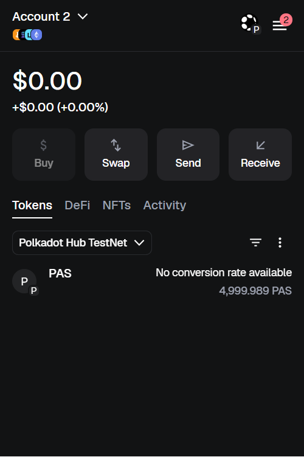
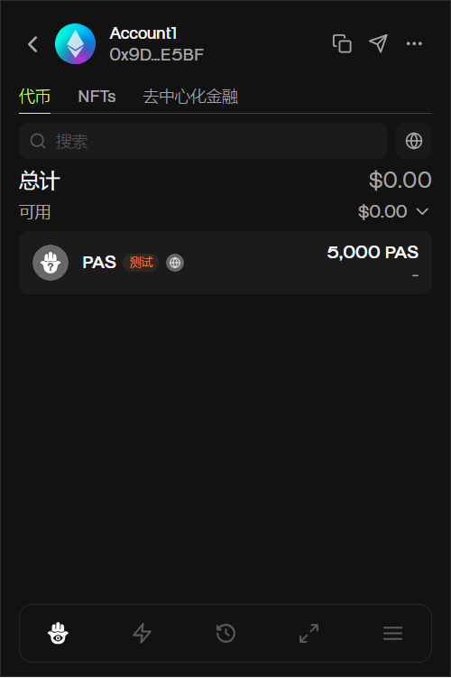
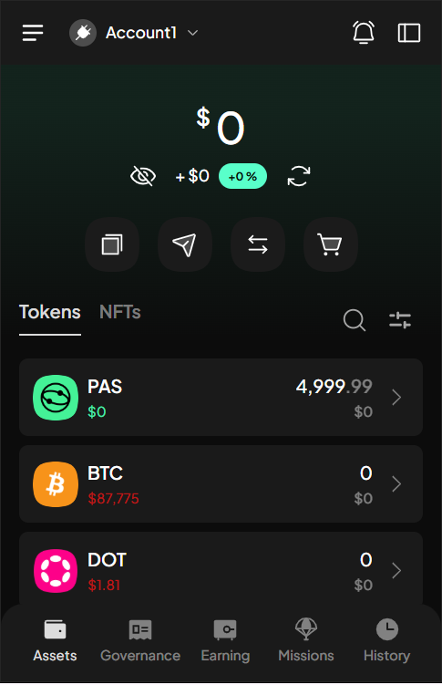
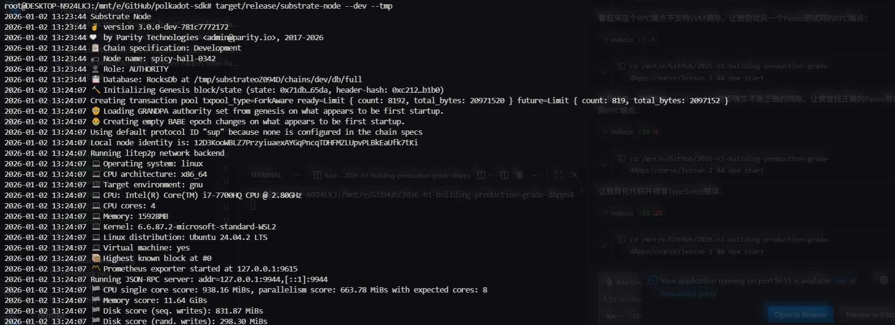
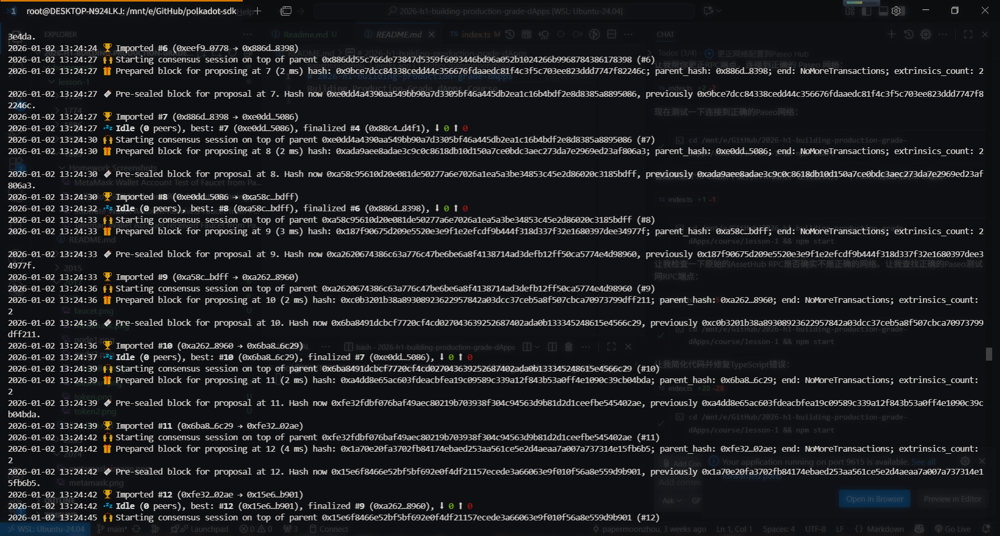
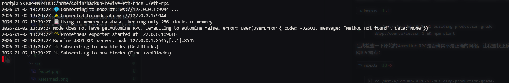
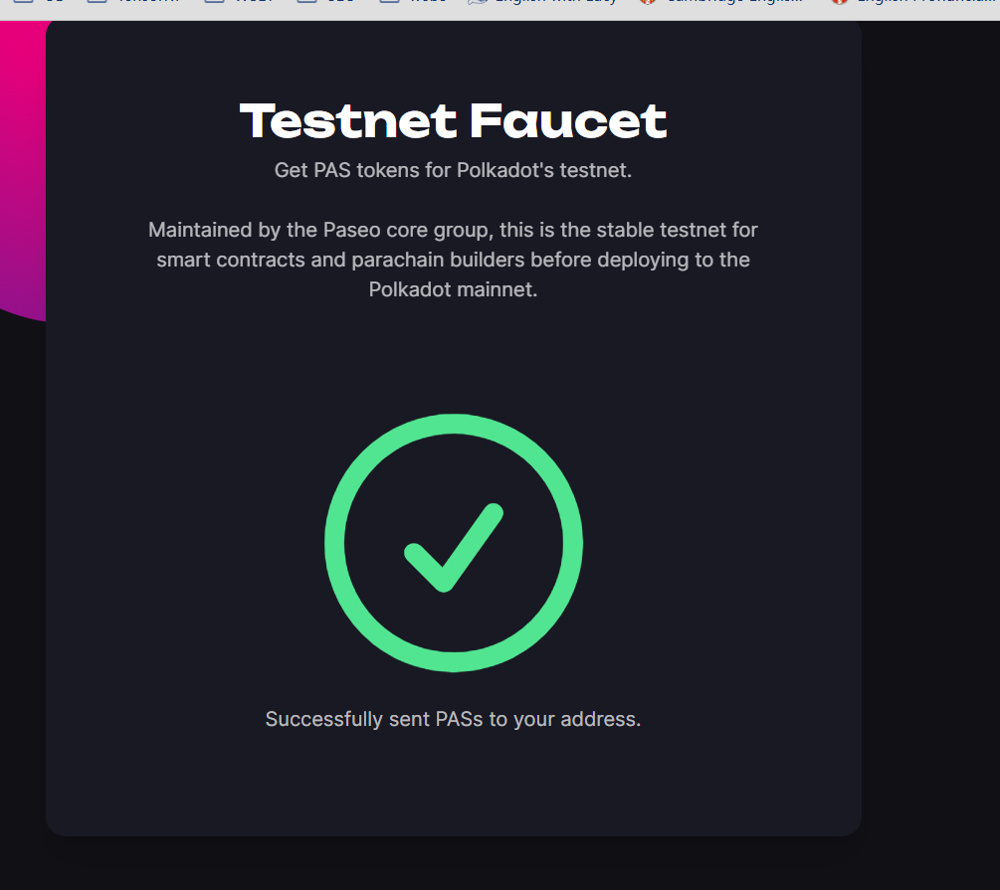
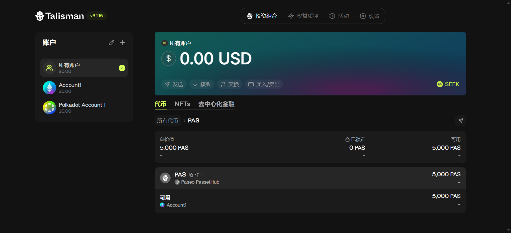
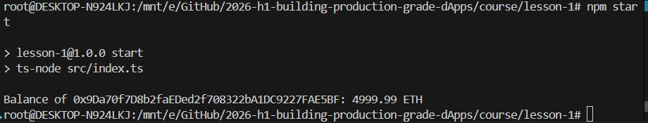

## 1. 安装三种不同的钱包，创建测试账户。

### MetaMask

## Tailsman

## Subwallet

## 2. 本地编译Polkadot SDK，启动节点和RPC服务

## 3. https://faucet.polkadot.io/?parachain=1111 得到测试token

## 4. 分别在钱包中和运行程序 https://github.com/papermoonio/2026-h1-building-production-grade-dApps/blob/main/course/lesson-1/src/index.ts 确认token领取成功

